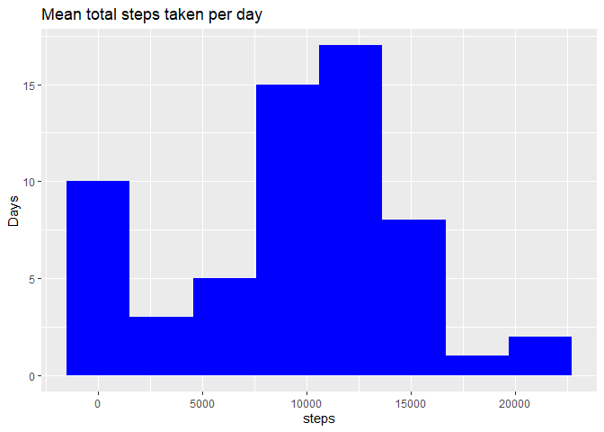
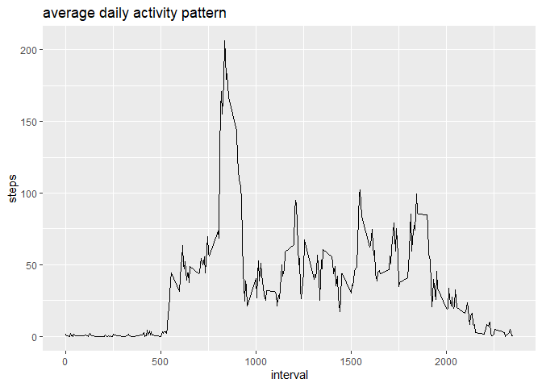
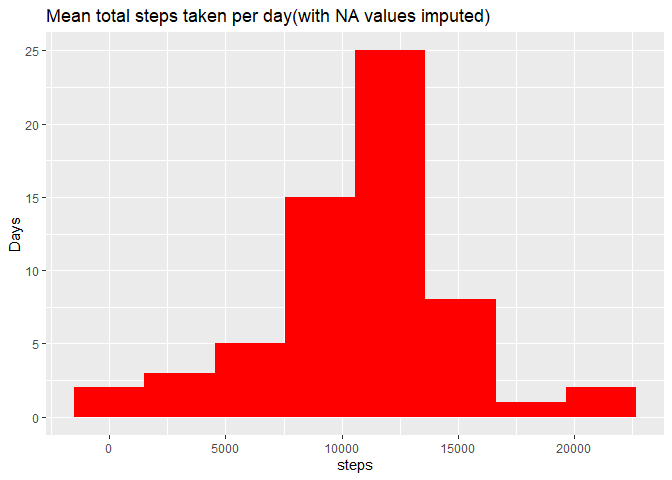
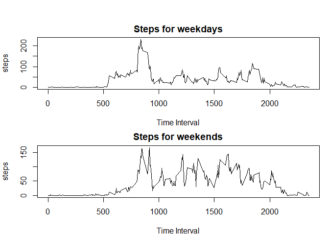

## Loading and preprocessing the data
  
  ```r
      library(ggplot2)
      unzip("activity.zip")
      data<-read.csv('activity.csv')
  ```
## What is mean total number of steps taken per day?
  
  ```r
      stepByDays<-data.frame(tapply(data$step,data$date,sum,na.rm=T))
      colnames(stepByDays)="steps"
      ggplot(stepByDays,aes(steps)) + 
      geom_histogram(bins = 8,fill="blue")+ylab("Days")+ggtitle("Mean total steps taken per day")
  ```
  
  <!-- -->
  
  ```r
      mean <- mean(stepByDays$steps)
      median <- median(stepByDays$steps)  
  ```
* The mean of the total number of steps taken per day is: 9354.2295082
* The median of the total number of steps taken per day is: 10395


## What is the average daily activity pattern?
  
  ```r
      stepInterval<-data.frame(tapply(data$step,data$interval,mean,na.rm=T))
      colnames(stepInterval)="steps"
      stepInterval$interval=as.numeric(row.names(stepInterval))
      ggplot(stepInterval,aes(interval,y=steps,group=1)) + 
      geom_line()+ggtitle("average daily activity pattern")
  ```
  
  <!-- -->
  
  ```r
      maxSteps<-max(data$steps,na.rm = T)
  ```
* The 5-minute interval which on average across all the days in the dataset, contains the maximum number of steps is:806 

## Imputing missing values

  
  ```r
      missing<-sum(is.na(data$steps))
  ```
* Total number of missing values in the dataset:2304
  
  
  ```r
     data2<-data
     slots <- unique(data2$interval)
      MissingData <- function(timeSlot) {
        data2[which(data$interval==timeSlot & is.na(data$steps)), ]$steps <<- 
        round(mean(data[which(data$interval==timeSlot ,),]$steps,na.rm=T))
      }
  
      MissValue<-lapply(slots, MissingData)
  ```
  
  ```r
      stepByDays<-data.frame(tapply(data2$step,data2$date,sum,na.rm=T))
      colnames(stepByDays)="steps"
      ggplot(stepByDays,aes(steps)) + 
      geom_histogram(bins = 8,fill="red")+ylab("Days")+
      ggtitle("Mean total steps taken per day(with NA values imputed)")
  ```
  
  <!-- -->
  
  ```r
      mean2 <- mean(stepByDays$steps)
      median2 <- median(stepByDays$steps)
  ```
* The imputed mean of the total number of steps taken per day is: 1.0765639\times 10^{4}

* The imputed median of the total number of steps taken per day is: 1.0762\times 10^{4}

### What is the impact of imputing missing data on the estimates of the total daily number of steps?
As can be seen by comparing the two histograms, the impact of imputing values based on averages per day is that the number of days with a step count between 10,000 and 15,000 steps has increased to over 25 - whereas before imputing the values, the number of days in this range was below 20. The mean number of steps has not changes and this is due to the algorithm making use of the mean number of steps to impute values. However the median has increased in line with an increase in the total number of steps.

## Are there differences in activity patterns between weekdays and weekends?

  
  ```r
      data2$day=weekdays(as.Date(data2$date))
      data2$typeDay[data2$day %in% c("Saturday","Sunday")]<-"Weekend"
      data2$typeDay[is.na(data2$typeDay)]<-"Weekday"
      #put the data of the weekdays
      weekday=data2[data2$typeDay=="Weekday",]
      weekday<-data.frame(tapply(weekday$step,weekday$interval,mean,na.rm=T))
      colnames(weekday)="steps"
      weekday$interval=as.numeric(row.names(weekday))
      weekday$interval=as.numeric(weekday$interval)
      #put the data of the weekends
      weekend=data2[data2$typeDay=="Weekend",]
      weekend<-data.frame(tapply(weekend$step,weekend$interval,mean,na.rm=T))
      colnames(weekend)="steps"
      weekend$interval=as.numeric(row.names(weekend))
      weekend$interval=as.numeric(weekend$interval)
      #plot the graphics
      par(mfrow=c(2,1), mar=c(4,4,2,1), oma=c(0,0,2,0))
      plot(steps~interval,data=weekday,type="l",
      main="Steps for weekdays", xlab="Time Interval", col="black")
      plot(steps~interval,data=weekend,type="l",
      main="Steps for weekends", xlab="Time Interval", col="black")
  ```
  
  <!-- -->
  
* From these two graphs it can be seen that over the weekend the step count is more evenly distributed throughout the day than during the week.
